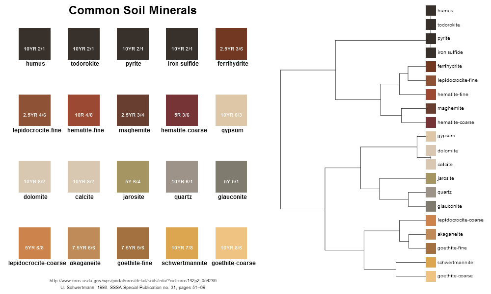

---
output:
  html_vignette:
    mathjax: null
    jquery: null
    smart: no
---

Munsell Colors for Some Soil Minerals
==================================
2016-10-20
<br>
D.E. Beaudette




[PDF version](files/common-soil-minerals.pdf)

You probably noticed the *minor* technical error: humus is not a soil mineral. Note that these colors were derived from a set of pure specimens under ideal lighting conditions. Soil colors in the field represent a complex moisture of pigments that are expressed differently as a function of particle size, organic matter content, water content, viewing angle, and lighting conditions (and many other factors of course). Have a look at some of the links below for more information on soil color.

Colors are organized according to a [divisive hierarchical clustering](https://en.wikipedia.org/wiki/Hierarchical_clustering#Divisive_clustering) of [CIE LAB](https://en.wikipedia.org/wiki/Lab_color_space) coordinates. Conversion of Munsell colors to RGB was performed with the `munsell2rgb()` function from the [aqp](https://github.com/ncss-tech/aqp) package for R. Conversion of RGB to LAB coordinates was performed with the [colorspace](https://cran.r-project.org/web/packages/colorspace/index.html) package for R.


## Links / Sources
 * [The Color of Soil](http://www.nrcs.usda.gov/wps/portal/nrcs/detail/soils/edu/?cid=nrcs142p2_054286)
 * Schwertmann, U. 1993. Relations Between Iron Oxides, Soil Color, and Soil Formation. "Soil Color". SSSA Special Publication no. 31, pages 51--69.
 * [The color scheme of carbon content: A simpler approach to gauging soil health](https://www.soils.org/discover-soils/story/color-scheme-carbon-content-simpler-approach-gauging-soil-health)
 * [Soil color never lies](http://blogs.egu.eu/divisions/sss/2014/03/30/soil-color-never-lies/)
 * [Wikipedia page on "Iron"](https://en.wikipedia.org/wiki/Iron)
 * [Soil Color Aggregation with aqp](http://ncss-tech.github.io/AQP/sharpshootR/aggregate-soil-color.html)
 * [Color Pencils by Munsell Color](http://colour.granjow.net/fabercastell-polychromos.html)

## R Code
You will probably need the latest version of [aqp](https://github.com/ncss-tech/aqp):
```r
devtools::install_github("ncss-tech/aqp", dependencies=FALSE, upgrade_dependencies=FALSE)
```

Feel free to re-make the above figure according to your aesthetic wants. 
```r
library(aqp)
library(ape)
library(cluster)
library(colorspace)

# load common soil mineral colors
data(soil_minerals)
# convert Munsell to R colors
soil_minerals$col <- munsell2rgb(soil_minerals$hue, soil_minerals$value, soil_minerals$chroma)

# make a grid for plotting
n <- ceiling(sqrt(nrow(soil_minerals)))
# read from top-left to bottom-right
g <- expand.grid(x=1:n, y=n:1)[1:nrow(soil_minerals),]

# convert Munsell -> RGB -> LAB
col.rgb <- munsell2rgb(soil_minerals$hue, soil_minerals$value, soil_minerals$chroma, return_triplets = TRUE)
col.lab <- as(RGB(as.matrix(col.rgb)), 'LAB')@coords
row.names(col.lab) <- soil_minerals$mineral

# divisive hierarchical clustering of LAB coordinates
d <- daisy(col.lab)
h <- as.hclust(diana(d))
p <- as.phylo(h)

# png(file='common-soil-minerals.png', width=1000, height=600, type='cairo', antialias = 'subpixel')
# pdf(file='common-soil-minerals.pdf', width=12, height=6, pointsize = 10)

# plot grid of mineral names / colors
layout(matrix(c(1,2), nrow=1), widths = c(1.25,1))
par(mar=c(1,0,0,1))
plot(g$x, g$y, pch=15, cex=12, axes=FALSE, xlab='', ylab='', col=rev(soil_minerals$col[h$order]), xlim=c(0.5,5.5), ylim=c(1.5,5.5))
text(g$x, g$y, rev(soil_minerals$mineral[h$order]), adj=c(0.45,5), cex=1, font=2)
text(g$x, g$y, rev(soil_minerals$color[h$order]), col='white', pos=1, cex=0.85, font=2)
title(main='Common Soil Minerals', line=-2, cex.main=2)
mtext('http://www.nrcs.usda.gov/wps/portal/nrcs/detail/soils/edu/?cid=nrcs142p2_054286', side=1, cex=0.75, line=-1.5)
mtext('U. Schwertmann, 1993. SSSA Special Publication no. 31, pages 51--69', side=1, cex=0.75, line=-0.5)

# dendrogram + tip labels with mineral colors
plot(p, cex=0.85, label.offset=1, font=1)
tiplabels(pch=15, cex=4, col=soil_minerals$col)

# dev.off()
```